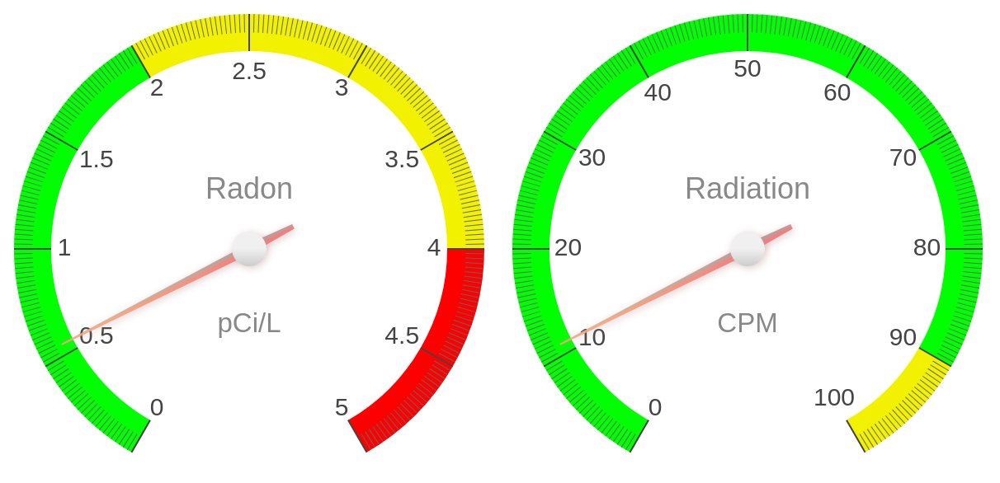

GQ RadonPro

GQ RadonPro is a software tool for the analysis of radon data. It is designed to be used by radon professionals, such as radon measurement professionals, radon mitigation professionals, and radon researchers. GQ RadonPro is a powerful tool that can be used to analyze radon data from a variety of sources, including continuous radon monitors, grab sample radon detectors, and passive radon detectors. It can be used to analyze radon data from both short-term and long-term radon tests, and it can be used to analyze radon data from both residential and commercial buildings. GQ RadonPro is designed to be easy to use, and it provides a wide range of features that make it a valuable tool for radon professionals.

